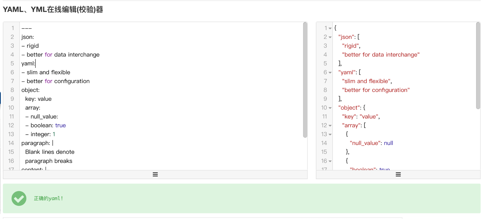

## Vitepress部署

### 配置图片放大功能

```ts
import mediumZoom from "medium-zoom";

const theme: Theme = {
  ...DefaultTheme,
  enhanceApp({ app }) {
    // ...
  },
  setup() {
    const route = useRoute();
    const initZoom = () => {
      mediumZoom(".main img", { background: "var(--vp-c-bg)" });
    };
    onMounted(() => {
      initZoom();
    });
    watch(
      () => route.path,
      () => nextTick(() => initZoom())
    );
  },
};

export default theme;
```

### 注意

版本不同可能会出现问题

> "vue": "^3.2.45"

> "vitepress": "1.0.0-alpha.69"

## Fusion-ui部署

### 报错一

::: warning
Unable to locate executable file: pnpm. Please verify either the file path exists or the file can be found within a directory specified by the PATH environment variable. Also check the file mode to verify the file is executable.
:::

::: info 翻译
无法找到可执行文件：pnpm。请验证文件路径是否存在，或者文件可以在 PATH 环境变量指定的目录中找到。还要检查文件模式以验证文件是可执行的。
:::
解决：

gitHub 工作流配置文件中添加 `run: npm i -g pnpm`

使用 yarn 安装，可能不会报错 无需添加

yml 完整配置：

```ts
name: Deploy

on:
  push:
    branches:
      - master

jobs:
  deploy:
    runs-on: ubuntu-latest
    steps:
      - uses: actions/checkout@v3
      - uses: actions/setup-node@v3
        with:
          node-version: 16

      - name: Install pnpm
        run: npm i -g pnpm
      - name: install & Build
        run: pnpm i && pnpm docs:build

      - name: Deploy
        uses: peaceiris/actions-gh-pages@v3
        with:
          github_token: ${{ secrets.GITHUB_TOKEN }}
          publish_dir: docs/.vitepress/dist
```

### 报错二

::: warning
 pnpm i && pnpm docs:build
  shell: /usr/bin/bash -e {0}
Scope: all 3 workspace projects
 ERR_PNPM_OUTDATED_LOCKFILE  Cannot install with "frozen-lockfile" because pnpm-lock.yaml is not up to date with docs/package.json

Note that in CI environments this setting is true by default. If you still need to run install in such cases, use "pnpm install --no-frozen-lockfile"

Failure reason:
specifiers in the lockfile ({"markdown-it":"^13.0.1","@fusion-ui/docs":"workspace:*",
    
"@types/markdown-it":"^12.2.3","unocss":"^0.50.0"}) don't match specs in package.json
    
({"@types/markdown-it":"^12.2.3","unocss":"^0.50.0","fusion-ui-vue":"^1.0.2",
     
"markdown-it":"^13.0.1"})
 Error: Process completed with exit code 1.

:::

::: info 翻译
范围：所有3个工作区项目

ERR_PNPM_OUTDATED_LOCKFILE 无法使用“frozen-lockfile”安装，因为pnpm-lock.yaml不是最新的docs/package.json

请注意，在CI环境中，默认情况下，此设置为真。如果您在这种情况下仍然需要运行安装，请使用“pnpm install --no-frozen-lockfile”

失败原因：

锁定文件中的指定符（{"markdown-it":"^13.0.1","@fusion-ui/docs":"workspace:*",

"@Types/markdown-it":"^12.2.3","unocss":"^0.50.0"}）与package.json中的规格不匹配

({"@Types/markdown-it":"^12.2.3","unocss":"^0.50.0","fusion-ui-vue":"^1.0.2",

"Markdown-it":"^13.0.1"}）

错误：使用退出代码1完成流程。

:::

解决：

运行 `pnpm install` 重新获取依赖

### 报错三

::: warning
/usr/bin/git push origin gh-pages
remote: Permission to tsinghua-lau/Fusion-Ui.git denied to github-actions[bot].
fatal: unable to access 'https://github.com/tsinghua-lau/Fusion-Ui.git/': The requested URL returned error: 403
Error: Action failed with "The process '/usr/bin/git' failed with exit code 128"
:::

::: info 翻译
/Usr/bin/git推送原点gh-pages
远程：对tsinghua-lau/Fusion-Ui.git的权限被拒绝给github-actions[bot]。
致命：无法访问'https://github.com/tsinghua-lau/Fusion-Ui.git/'：请求的URL返回错误：403
错误：操作失败，使用“进程'/usr/bin/git'以退出代码128失败
:::


解决：

 进入项目的 Settings -> Secrets -> Actions -> general -> 勾选权限
 

 ### 报错四

 ::: warning
 Invalid workflow file: .github/workflows/deploy.yml#L2
 You have an error in your yaml syntax on line 2
:::

::: info 翻译
无效的工作流文件：.github/workflows/deploy.yml#L2
第2行的yaml语法有错误
:::

解决：
 yml 文件格式错误，检查格式，在线检测工具：https://www.bejson.com/validators/yaml_editor/

 

### 报错五
::: warning
input: chore:build ✖   subject may not be empty [subject-empty] ✖   type may not be empty [type-empty]
:::

::: info 翻译
无效的工作流文件：.github/workflows/deploy.yml#L2
第2行的yaml语法有错误
:::

解决：

提交信息格式错误，改为：`chore: build`